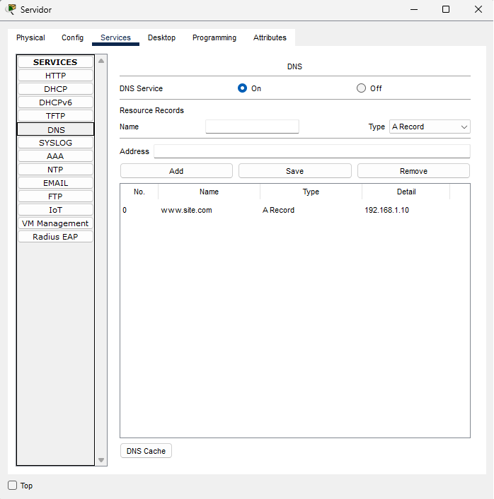
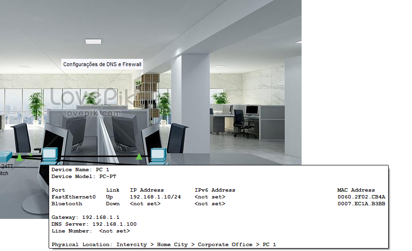
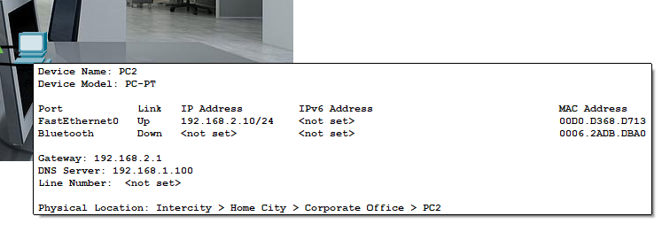
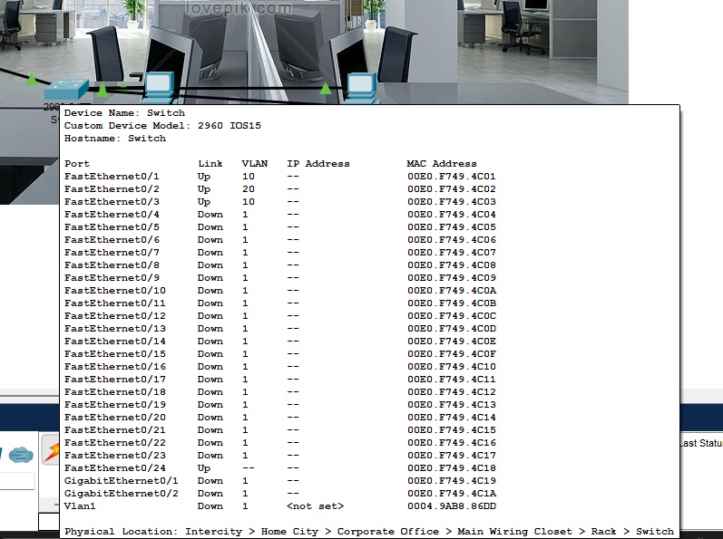
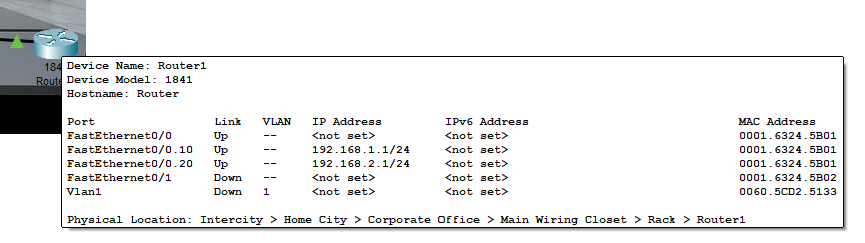

# Desafio: Configuração de DNS e Firewall com Cisco Packet Tracer

## 📘 Sobre o Projeto

Este projeto simula um ambiente de rede de uma empresa utilizando **Cisco Packet Tracer**, com foco nos seguintes pontos:

- Configuração de um **servidor DNS**
- Dois computadores clientes (**PC1** e **PC2**)
- Um **switch 2960** para conectar os dispositivos
- Um **roteador 1841** com ACLs (firewall)
- Bloqueio de comunicação entre os PCs usando ACL
- Testes de conectividade usando `ping`

## 🖥️ Topologia

Todos os dispositivos estão conectados ao mesmo **Switch 2960**, com **um único cabo** indo do switch para a porta **Fa0/0** do roteador.

```
[PC1]      [PC2]       >----[Switch]----[Fa0/0 - Roteador 1841]
[Servidor] /
```

## ⚙️ Passo a Passo Realizado

### 1. Configuração do Servidor DNS

- IP do Servidor DNS: `192.168.1.100`
- DNS configurado para resolver o domínio `www.site.com` para `192.168.1.10` (IP do PC1)

### 2. Configuração dos PCs

- Ambos os PCs (PC1 e PC2) estão configurados com DNS Server apontando para o IP do servidor DNS (`192.168.1.100`)
- Sub-rede dos PCs:
  - PC1: `192.168.1.10`
  - PC2: `192.168.2.10` (em outra sub-rede para permitir bloqueio)

### 3. Testes de DNS

- No PC1, usando o prompt de comando, foi executado:
  ```
  ping www.site.com
  ```
  - O nome foi resolvido com sucesso para o IP `192.168.1.10`

### 4. Configuração do Roteador como Firewall

- Criada uma ACL com os comandos abaixo:
  ```
  access-list 100 deny ip 192.168.2.10 0.0.0.0 192.168.1.10 0.0.0.0
  access-list 100 permit ip any any
  interface FastEthernet0/0
  ip access-group 100 in
  ```
- Isso bloqueia o tráfego de **PC2 para PC1**

### 5. Testes de Firewall

- No PC2: `ping 192.168.1.10` → **falhou** (como esperado)
- No PC1: `ping 192.168.2.10` → **funcionou** (comunicação permitida)

## 🖼️ Capturas de Tela

### 🔌 Topologia da Rede
> Estrutura completa com os 2 PCs, servidor, switch e roteador conectados.


---

### 🌐 Configuração de DNS no Servidor
> Demonstração da aba `Services -> DNS` com o domínio `www.site.com` configurado.


---

### 🖥️ Detalhes do Servidor
> Mostra o modelo do equipamento, IP, MAC Address e informações da interface.


---

### 💻 PC1 – Configuração de Rede
> Mostra o modelo, IP, MAC Address, Gateway e DNS Server configurado no PC1.


---

### 💻 PC2 – Configuração de Rede
> Mostra o modelo, IP, MAC Address, Gateway e DNS Server configurado no PC2.


---

### 📶 Switch Detalhes
> Apresenta o modelo do switch (2960) e as portas que estão conectadas aos dispositivos.


---

### 🌐 Roteador Detalhes
> Informações do roteador (1841), portas conectadas e IP configurado na interface.



## 📂 Arquivos Incluídos

- `dns-firewall.pkt`: Arquivo da simulação no Cisco Packet Tracer
- `README.md`: Este documento explicando o projeto

## 👩‍💻 Autora

Biatriz Gomes

---
